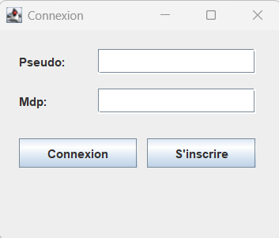
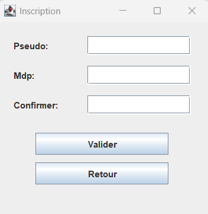
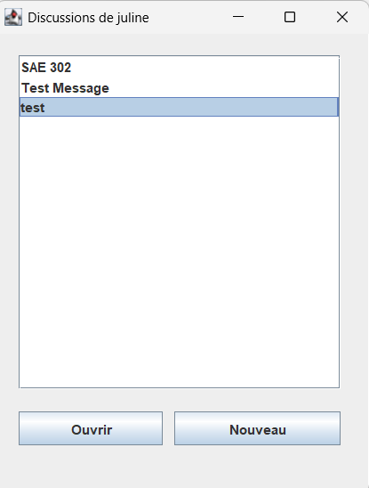
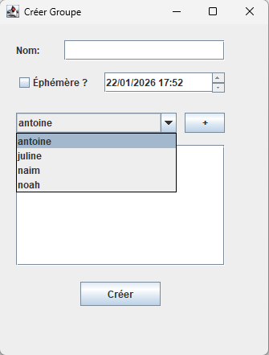
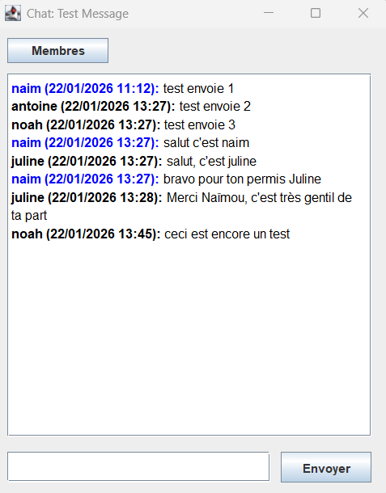
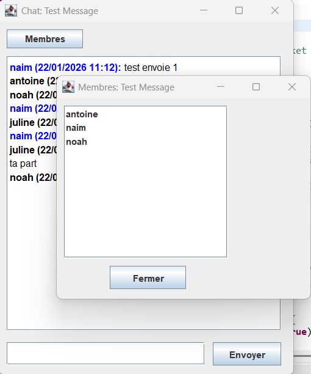

# SAE302 - sae-302-ghares-pierrat-roullet

## README

### A propos de ce projet
Ce projet consiste en la conception et le développement d'une application de messagerie instantanée en réseau (Architecture Client/Serveur) utilisant les Sockets TCP en Java.

Ce projet a été réalisé par :
* Naïm GHARES
* Antoine PIERRAT
* Noah ROULLET

### Principales caractéristiques
L'application propose les fonctionnalités suivantes :
* **Authentification :** Connexion sécurisée via le serveur et possibilité de création d'un compte utilisateur.
* **Chat Multi-clients :** Communication en temps réel entre plusieurs utilisateurs.
* **Gestion de Groupes :** Création de conversations à plusieurs avec sélection aisée des membres.
* **Discussions Éphémères :** Possibilité de définir une date de fin pour un groupe.
* **Interface Graphique :** Interface complète réalisée en Java Swing.

---

### État du projet (Bilan et Évolutions)

Par rapport aux premiers livrables, le projet est désormais terminé. Nous avons réussi à implémenter l'intégralité des fonctionnalités prévues dans les premiers livrables.

**Bilan des fonctionnalités opérationnelles :**

* **Architecture complète :** Connexion Client/Serveur stable avec authentification en base de données.
* **Messagerie :** Envoi et réception de messages en temps réel.
* **Ergonomie et Design (Améliorations récentes) :**
    * **Création de discussion simplifiée :** Intégration réussie d'une liste déroulante pour sélectionner les utilisateurs à ajouter, remplaçant la saisie manuelle fastidieuse.
    * **Affichage optimisé du Chat :** Utilisation de code couleur (pseudo en bleu pour l'utilisateur connecté) et de gras pour améliorer la lisibilité de l'historique.
* **Performance :** Gestion optimisée des ressources (arrêt des processus de rafraîchissement à la fermeture des fenêtres).
* **Administration :** Le compte "admin" est fonctionnel et possède une visibilité globale sur toutes les discussions créées (pour créer un compte admin, il suffit de mettre à 1 la variable est_admin dans la table UTILISATEUR de la base de données pour l'utilisateur en question).
* **Sécurité :** Vérification de la complexité du mot de passe à l'inscription et hachage du mot de passe côté client avant envoi sur le réseau.

---

### Aperçu des Fenêtres de l'application

**1. Fenêtre de Connexion**
C'est le point d'entrée de l'application.
* **Champs Pseudo/Mdp :** Permettent de saisir ses identifiants.
* **Bouton "Connexion" :** Tente de s'authentifier auprès du serveur.
* **Bouton "S'inscrire" :** Ouvre la fenêtre de création de compte si l'utilisateur n'en a pas.

**2. Fenêtre d'Inscription**

Permet de créer un nouvel utilisateur.
* **Champs de saisie :** Pseudo, Mot de passe et confirmation. Le système vérifie la complexité du mot de passe.
* **Bouton "Valider" :** Envoie la demande de création de compte au serveur.
* **Bouton "Retour" :** Revient à l'écran de connexion.

**3. Fenêtre Principale (Liste des discussions)**

C'est le menu Principale de l'application qui s'ouvre après une connexion réussie.
* **Liste centrale :** Affiche toutes les discussions auxquelles l'utilisateur appartient. La sélection est conservée lors du rafraîchissement automatique.
* **Bouton "Ouvrir" :** Lance la fenêtre de chat pour la discussion sélectionnée dans la liste.
* **Bouton "Nouveau" :** Ouvre la fenêtre de création d'une nouvelle discussion.

**4. Fenêtre de Création de Groupe**

Interface pour configurer une nouvelle conversation.
* **Champ "Nom" :** Pour donner un titre à la discussion.
* **Case à cocher" :** Si cochée, active le sélecteur de date/heure pour définir l'expiration du groupe.
* **Liste déroulante et Bouton "+" :** Permet de choisir facilement un utilisateur parmi les inscrits et de l'ajouter à la liste des participants juste en dessous.
* **Bouton "Créer" :** Valide la création du groupe avec les options choisies.

**5. Fenêtre de Discussion (Chat)**

La fenêtre d'une discussion selectionné via la fenêtre principale qui permet d'échanger avec d'autres utilisateurs.
* **Zone d'affichage :** Affiche l'historique des messages avec formatage couleur (bleu pour soi) et gras.
* **Bouton "Membres" :** Ouvre une pop-up listant les participants actuels.
* **Champ de saisie (bas) :** Pour taper un nouveau message.
* **Bouton "Envoyer" :** Expédie le message saisi aux autres membres du groupe.

**6. Fenêtre des Membres**

Simple fenêtre pop-up informative.
* **Liste :** Affiche les pseudos des utilisateurs présents dans la discussion en cours.
* **Bouton "Fermer" :** Ferme la pop-up.

---

### Comment installer l'application ?
L'installation nécessite de récupérer les sources et de les importer dans un IDE.

**1. Récupération des fichiers (SCM) :**
* Clonez le dépôt ou téléchargez l'archive ZIP depuis le gestionnaire de version (GitLab).
* Assurez-vous de bien avoir récupéré les deux dossiers essentiels à la racine :
    * **src** : Contient tout le code source Java (packages client, serveur, partage).
    * **lib** : Contient le driver JDBC (mariadb-java-client-3.0.8.jar) nécessaire pour la base de données.

**2. Importation dans Eclipse :**
* Ouvrez Eclipse.
* Allez dans File > Import > General > Existing Projects into Workspace.
* Sélectionnez le dossier où vous avez téléchargé les fichiers et assurez-vous que le dossier racine est sélectionné (dans notre cas le fichier racine est: sae302-ghares-pierrat-roullet).
* Cochez le projet et cliquez sur Finish.

**3. Configuration de la Base de Données :**

Il faut déjà créer la base de données pour cela, vous pouvez retrouver le script de création de notre BDD :

* sql > script.sql

Avant de lancer le serveur, vous devez configurer la connexion à votre base de données.
* Localisez le fichier configuration.properties situé dans le dossier properties.
* Ouvrez ce fichier et remplacez les valeurs existantes par vos propres informations de connexion si nécessaire :
    * **db_host** : L'adresse IP et le port de votre serveur BDD (ex: 127.0.0.1:3306).
    * **db_user** : Votre identifiant utilisateur BDD (ex: 22401429t).
    * **db_pwd** : Votre mot de passe BDD.
    * **db_name** : Le nom de votre base de données.

### Comment utiliser l'application ?
L'application nécessite de lancer d'abord le serveur, puis un ou plusieurs clients.

**Étape 1 : Démarrer le Serveur**
* Dans l'arborescence (src), ouvrez le package serveur.
* Faites un clic droit sur le fichier ServeurMain.java > Run As > Java Application.

**Étape 2 : Démarrer le(s) Client(s)**
* Ouvrez le package client se trouvant lui aussi dans src dans l'arborescence.
* Faites un clic droit sur le fichier ClientMain.java > Run As > Java Application.
* La fenêtre de connexion doit s'ouvrir.
* Vous pouvez lancer ce fichier plusieurs fois pour simuler plusieurs utilisateurs.

**Comptes de test :**

Si vous souhaitez tester rapidement l'application sans créer de compte, vous pouvez utiliser l'utilisateur standard suivant : 
* Pseudo: noah
* Mot de passe: 1234

Nous mettons également à disposition le compte administrateur pour tester la visibilité globale des chats. Pour rappel, ce compte a été créé en mettant manuellement l'attribut `est_admin` à 1 dans la base de données : 
* Pseudo: juline
* Mot de passe: Labeljuline<3
