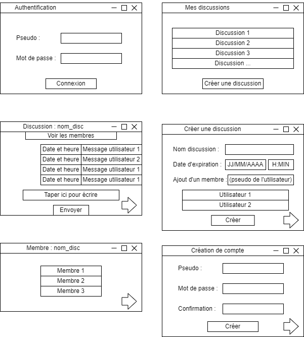
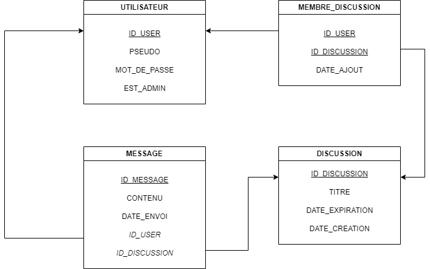
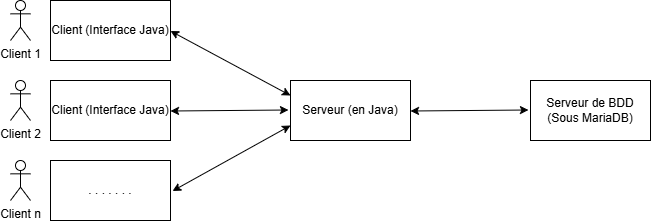

# SAE302 - Développer des applications communicantes
# Livrable 1 : Spécifications fonctionnelles

## Etudiants
* GHARES Naïm
* ROULLET Noah
* PIERRAT Antoine

## 1. Liste des spécifications

Notre projet est une application de messagerie instantanée ("Chat"). Elle permet des échanges privés et de groupe, avec une gestion avancée de la confidentialité (discussions éphémères) et de la modération (admin).

### Fonctionnalités principales

1.  **Authentification et Inscription**
    * Connexion sécurisée via Login et Mot de passe.
    * Possibilité de créer un compte (Inscription) via une interface dédiée si l'utilisateur n'en possède pas.

2.  **Gestion des Discussions**
    * Un utilisateur ne voit que les conversations auxquelles il participe.
    * **Création :** Un utilisateur peut créer une discussion en choisissant un titre et en ajoutant les participants (via leurs pseudos).
    * **Privé :** Discussion entre deux utilisateurs.
    * **Groupe :** Discussion incluant plusieurs participants.

3.  **Messagerie (Synchrone et Asynchrone)**
    * **Synchrone :** Lorsque les utilisateurs d'une discussion sont connectés en même temps, les messages s'échangent et s'affichent en temps réel.
    * **Asynchrone :** Si un utilisateur n'est pas connecté, les messages sont stockés en base de données et seront chargés ("Récupération de l'historique") à sa prochaine connexion.

4.  **Admin**
    * L'Administrateur possède un privilège global : il peut consulter toutes les discussions, y compris celles qui sont expirées (éphémères).
    * Cela permet de vérifier la persistance des données et de modérer le contenu.

### Idées d'améliorations futures (Bonus)
Si le temps le permet, nous envisageons d'ajouter :
1.  **Modification par l'admin :** L'admin pourra modifier le mot de passe d'un utilisateur dans la BDD en cas d'oubli.
2.  **Politique de mot de passe :** Imposer une sécurité minimale (longueur, caractères spéciaux) lors de l'inscription.
3.  **Discussions Éphémères**
    * Création de salons avec une date et une heure de fin précises (ex: Fin le 12/12/2025 à 18h00).
    * Une fois cette date dépassée, la discussion disparaît de l'interface des participants.
    * *Note technique :* Les données restent stockées en base de données pour la traçabilité, mais sont filtrées par le serveur.

---

## 2. Choix Techniques

Voici les solutions techniques retenues pour répondre aux contraintes du projet :

1.  **Type de communication :**
    * Nous avons opté pour une communication hybride : Synchrone (Temps réel) quand les clients sont connectés, et Asynchrone (Stockage BDD) pour la consultation d'historique. Les échanges se font via des Sockets TCP. Les données transitent sous forme d'Objets Java Sérialisés.

2.  **Organisation des échanges :**
    * Le système fonctionne par Discussions (Channels). Contrairement à un simple chat global, nous utilisons une table d'association en base de données pour gérer les permissions : un utilisateur ne reçoit les messages que des discussions où il est inscrit.

3.  **Authentification :**
    * À l'ouverture de l'application, une authentification sera demandée.
    * Le mot de passe sera haché en MD5 avant d'être stocké en base de données pour assurer la confidentialité.

4.  **Architecture Serveur :**
    * Le serveur est Multi-Thread. Pour chaque client qui se connecte, le serveur lance un Thread dédié. Cela permet de gérer plusieurs conversations en parallèle sans bloquer le programme principal.

5.  **Gestion des données :**
    * Toutes les informations (Utilisateurs, Discussions, Messages) sont stockées dans la BDD (même les discussions supprimées et les discussions éphémères).

6.  **Interface Graphique :**
    * Le client est une application développée avec la bibliothèque Java Swing.

---

## 3. Schéma de l'interface graphique

Voici les différentes fenêtres de l'application et leur fonctionnement (interface susceptible d'évoluer) :

### 1. Fenêtre d'Authentification
C'est le point d'entrée de l'application.
* **Fonction :** L'utilisateur saisit son Pseudo et son Mot de passe.
* **Connexion :** Au clic sur le bouton, le client envoie les infos au serveur pour vérification.
* **Inscription :** Permet d'accéder à la fenêtre de création de compte pour les nouveaux utilisateurs.

### 2. Fenêtre Principale ("Mes discussions")
C'est le tableau de bord de l'utilisateur.
* **Liste des discussions :** Affiche uniquement les conversations auxquelles l'utilisateur appartient.
* **Action :** Un simple clic sur une discussion ouvre la fenêtre de chat correspondante.
* **Bouton "Créer une discussion" :** Permet d'ouvrir l'interface de création d'un nouveau groupe.

### 3. Fenêtre de Chat ("Discussion")
L'interface de communication en temps réel.
* **Zone d'historique :** Affiche les messages précédents (Date, Contenu, Auteur).
* **Zone de saisie :** Permet d'envoyer un message.
* **Navigation :** Une flèche permet de revenir au menu principal ("Mes discussions").
* **Bouton "Voir les membres" :** Ouvre la liste des participants.

### 4. Fenêtre de Création de Discussion
L'interface pour lancer une nouvelle conversation.
* **Nom :** Le titre du groupe.
* **Date de fin (Éphémère) :** Permet de choisir une date et une heure d'expiration précise. (Si vide = Permanent).
* **Ajout de membres :** L'utilisateur tape le pseudo d'un camarade pour l'ajouter.
* **Navigation :** Une flèche permet d'annuler et de revenir au menu principal.

### 5. Fenêtre des Membres
* **Fonction :** Liste tous les utilisateurs qui ont accès à la discussion en cours.
* **Navigation :** Une flèche permet de fermer la liste et revenir au chat.

### 6. Fenêtre de Création de compte
Interface d'inscription pour les nouveaux arrivants.
* **Champs :** Pseudo, Mot de passe et Confirmation du mot de passe.
* **Action :** Le bouton "Créer" enregistre le nouvel utilisateur en base de données.
* **Navigation :** Une flèche permet de revenir à la fenêtre d'authentification.

---

## 4. Liste des tables

1.  **Table UTILISATEUR**
    * *Attributs :* id_user (PK), pseudo, mot_de_passe, est_admin.
    * *Pourquoi ?* Pour gérer l'inscription, la connexion (mdp haché MD5) et identifier l'Administrateur.

2.  **Table DISCUSSION**
    * *Attributs :* id_discussion (PK), titre, date_expiration, date_creation.
    * *Pourquoi ?* Pour créer les "salles". L'attribut date_expiration permet de définir un moment précis de fin (NULL si permanent).

3.  **Table MEMBRE_DISCUSSION**
    * *Attributs :* id_user (FK et PK), id_discussion (FK et PK).
    * *Pourquoi ?* Pour la sécurité. Elle définit "Qui est dans quel groupe". Si un utilisateur n'est pas dans cette liste, il ne voit pas la discussion.

4.  **Table MESSAGE**
    * *Attributs :* id_message, contenu, date_envoi, id_user (FK), id_discussion (FK).
    * *Pourquoi ?* Pour stocker tout l'historique des conversations.

## Modèle Logique de Données :

---

## 5. Architecture de communication (clients/serveur/BDD)

Voici le schéma illustrant les flux de données entre les clients et la base de données :

Comme le montre ce schéma, les clients ne communiquent pas directement avec la Base de Données. Ils passent obligatoirement par un serveur central. Ce serveur joue le rôle d'intermédiaire : il reçoit les requêtes de tous les clients et se charge d'interroger la base de données pour eux.

---

## 6. Organisation et Répartition des tâches

Voici l'ordre de réalisation prévu et la répartition entre les membres du groupe :

1.  **Base de Données (Script SQL)**
    * *Réalisé par :* Tout le groupe
    * Création des tables et du jeu de données de test.

2.  **Structure Java (Client/Serveur)**
    * *Réalisé par :* Naïm
    * Mise en place des packages et des classes principales.

3.  **Sockets et Connexion**
    * *Réalisé par :* Noah
    * Développement de la connexion réseau de base entre le client et le serveur.

4.  **Authentification et MD5**
    * *Réalisé par :* Antoine
    * Gestion de la connexion sécurisée avec hashage du mot de passe

5.  **Interface Graphique**
    * *Réalisé par :* Naïm
    * Création des fenêtres Swing (Connexion, Liste discussions, Chat, Inscription).

6.  **Gestion Multi-Thread et Messages**
    * *Réalisé par :* Noah et Antoine
    * Gestion des échanges simultanés et de l'historique.